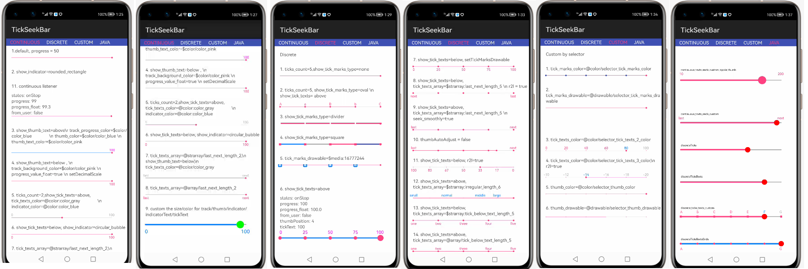

# TickSeekBar

[](https://sonarcloud.io/dashboard?id=applibgroup_TickSeekBar)
[](https://github.com/applibgroup/TickSeekBar/actions/workflows/main.yml)

## Introduction

This is a customizable SeekBar library on Android. Also, If you need Indicator to show top of seek bar.

# Source

The code in this repository was inspired from https://github.com/warkiz/TickSeekBar. We are very thankful to warkiz.

## Screenshot


&nbsp;&nbsp;&nbsp;&nbsp;&nbsp;&nbsp;&nbsp;&nbsp;&nbsp;&nbsp;&nbsp;&nbsp;&nbsp;&nbsp;&nbsp;&nbsp;

## Features

* Continuous seek bar
* Tick seek bar
* Customizable continuous or tick seek bar
* Creating seek bars from Java code
* Follows Material Design guidelines

## Installation

In order to use the library, add the following line to your **root** gradle file:

1. For using TickSeekBar module in sample app, include the source code and add the below dependencies in entry/build.gradle to generate hap/support.har.
```
	implementation fileTree(dir: 'libs', include: ['*.jar', '*.har'])
        implementation project(path: ':tickseekbar')
        implementation project(path: ':tickseekbar')
        testImplementation 'junit:junit:4.13'
        ohosTestImplementation 'com.huawei.ohos.testkit:runner:1.0.0.100'
```
2. For using TickSeekBar in separate application using har file, add the har file in the entry/libs folder and add the dependencies in entry/build.gradle file.
```
	dependencies {
            implementation fileTree(dir: 'libs', include: ['*.har'])
            testCompile 'junit:junit:4.12'
	}

```


## Usage

To use TickSeekBar in your app simply follow below simple steps:

#### xml

``` <com.warkiz.tickseekbar.TickSeekBar
        ohos:id="$+id:listener"
        ohos:width="match_parent"
        ohos:height="match_content"
        app:tsb_show_tick_marks_type="oval"
        app:tsb_show_tick_texts="above"
        app:tsb_thumb_color="$color:colorAccent"
        app:tsb_thumb_size="16vp"
        app:tsb_tick_marks_color="$color:colorAccent"
        app:tsb_tick_marks_size="8vp"
        app:tsb_tick_texts_color="$color:color_pink"
        app:tsb_tick_texts_size="13vp"
        app:tsb_ticks_count="5"
        app:tsb_track_background_color="$color:color_gray"
        app:tsb_track_background_size="2vp"
        app:tsb_track_progress_color="$color:color_blue"
        app:tsb_track_progress_size="3vp" />
```

#### Java

```    TickSeekBar seekBar = TickSeekBar
                    .with(mContext)
                    .max(TickSeekBarConstants.CUSTOM_MAX_VALUE)
                    .min(TickSeekBarConstants.CUSTOM_DISCRETE_TICKS_MIN)
                    .progressValueFloat(true)
                    .progress(TickSeekBarConstants.CUSTOM_PROGRESS_VALUE)
                    .tickCount(TickSeekBarConstants.CUSTOM_TICK_COUNT)
                    .showTickMarksType(TickMarkType.DIVIDER)
                    .tickMarksColor(new Color(ResourceTable.Color_color_blue))
                    .tickMarksSize(TickSeekBarConstants.CUSTOM_DISCRETE_TICK_MARKS_SIZE)
                    .tickTextsSize(TickSeekBarConstants.CUSTOM_TICK_TEXTS_SIZE)
                    .showTickTextsPosition(TextPosition.ABOVE)
                    .tickTextsColorStateList(StateElementUtil.initTickTextColorState(TickSeekBarConstants.INDEX_VALUE_THREE))
                    .thumbColor(new Color(mContext.getResourceManager().getElement(ResourceTable.Color_color_1).getColor()))
                    .thumbSize(TickSeekBarConstants.CUSTOM_THUMB_SIZE)
                    .trackProgressColor(new Color(mContext.getResourceManager().getElement(ResourceTable.Color_colorAccent).getColor()))
                    .trackProgressSize(TickSeekBarConstants.CUSTOM_TRACK_PROGRESS_SIZE)
                    .trackBackgroundColor(new Color(mContext.getResourceManager().getElement(ResourceTable.Color_color_gray).getColor()))
                    .trackBackgroundSize(2)
                    .build();
```

## Custom section tracks color
The color of every block of seek bar can also be custom.

```sectionSeekBar.customSectionTrackColor(new ColorCollector() {
    @Override
    public boolean collectSectionTrackColor(int[] colorIntArr) {
        //the length of colorIntArray equals section count
        colorIntArr[0] = getResources().getColor(R.color.color_blue, null);
        colorIntArr[1] = getResources().getColor(R.color.color_gray, null);
        colorIntArr[2] = Color.parseColor("#FF4081");
        ...
        return true; //True if apply color , otherwise no change
    }
});
```

## Selector color were supported, drawable elements not yet supported

You can set the StateElement for the thumb, tickMarks, tickText colors in Java. Xml selector not supported.
Usage's format acccording to:


Thumb selector color:

```StateElement drawableStateElement = new StateElement();
        drawableStateElement.addState(new int[] {ComponentState.COMPONENT_STATE_PRESSED},
                createCircularDrawable(context, com.warkiz.tickseekbar.ResourceTable.Color_color_blue,
                        TickSeekBarConstants.DEFAULT_PIXEL_MAP_HEIGHT));
        drawableStateElement.addState(new int[] {ComponentState.COMPONENT_STATE_EMPTY},
                createCircularDrawable(context, com.warkiz.tickseekbar.ResourceTable.Color_colorAccent,
                        TickSeekBarConstants.DEFAULT_PIXEL_MAP_HEIGHT));
```

TickMarks selector color：

```StateElement drawableStateElement = new StateElement();
        drawableStateElement.addState(new int[] {ComponentState.COMPONENT_STATE_SELECTED},
                createCircularDrawable(context, com.warkiz.tickseekbar.ResourceTable.Color_colorPrimary,
                        TickSeekBarConstants.DEFAULT_PIXEL_MAP_HEIGHT));
        drawableStateElement.addState(new int[] {ComponentState.COMPONENT_STATE_FOCUSED},
                createCircularDrawable(context, com.warkiz.tickseekbar.ResourceTable.Color_colorAccent,
                        TickSeekBarConstants.DEFAULT_PIXEL_MAP_HEIGHT));
        drawableStateElement.addState(new int[] {ComponentState.COMPONENT_STATE_EMPTY},
                createCircularDrawable(context, com.warkiz.tickseekbar.ResourceTable.Color_color_gray,
                        TickSeekBarConstants.DEFAULT_PIXEL_MAP_HEIGHT));
```

TickTexts selector color：

```    if (stateSet.length > 0 && stateSet[0] == COMPONENT_STATE_SELECTED){
                    mSelectedTextsColor = new Color(getContext().getColor(ResourceTable.Color_colorAccent));
                    mUnselectedTextsColor = new Color(getContext().getColor(ResourceTable.Color_color_gray));
                    mHoveredTextColor = new Color(getContext().getColor(ResourceTable.Color_color_blue));
                } else if (stateSet.length > 1 && stateSet[1] == COMPONENT_STATE_HOVERED) {
                    mSelectedTextsColor = new Color(getContext().getColor(ResourceTable.Color_colorAccent));
                    mHoveredTextColor = new Color(getContext().getColor(ResourceTable.Color_color_blue));
                } else {
                    mUnselectedTextsColor = new Color(getContext().getColor(ResourceTable.Color_color_gray));
                    mSelectedTextsColor = mUnselectedTextsColor;
                    mHoveredTextColor = mUnselectedTextsColor;
                }
```

## Listener
```seekBar.setOnSeekChangeListener(new OnSeekChangeListener() {
        @Override
        public void onSeeking(SeekParams seekParams) {
            Log.i(TAG, seekParams.seekBar);
            Log.i(TAG, seekParams.progress);
            Log.i(TAG, seekParams.progressFloat);
            Log.i(TAG, seekParams.fromUser);
            //when tick count > 0
            Log.i(TAG, seekParams.thumbPosition);
            Log.i(TAG, seekParams.tickText);
        }

        @Override
        public void onStartTrackingTouch(TickSeekBar seekBar) {
        }

        @Override
        public void onStopTrackingTouch(TickSeekBar seekBar) {
        }

});
```
## Support & extension

Currently there is a limitation to set drawable elements from app side. So drawable cannot be set from sample app to ticks or thumbs.

## License
``` 
    Copyright (C) 2017 zhuangguangquan warkiz
    
    Licensed under the Apache License, Version 2.0 (the "License");
    you may not use this file except in compliance with the License.
    You may obtain a copy of the License at
    
       http://www.apache.org/licenses/LICENSE-2.0
    
    Unless required by applicable law or agreed to in writing, software
    distributed under the License is distributed on an "AS IS" BASIS,
    WITHOUT WARRANTIES OR CONDITIONS OF ANY KIND, either express or implied.
    See the License for the specific language governing permissions and
    limitations under the License.
```